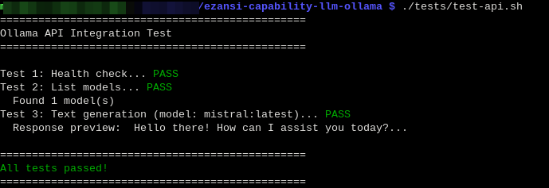
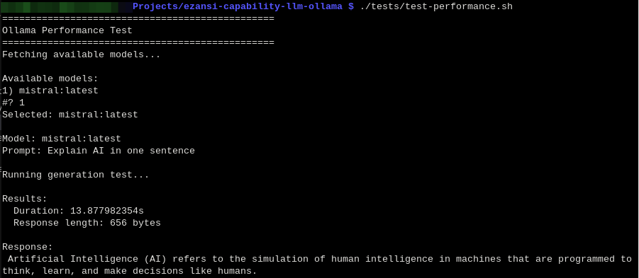

# ezansi-capability-llm-ollama

Ollama LLM Capability for eZansiEdgeAI — a modular, containerized text-generation service designed for Raspberry Pi (ARM64) and AMD64 (x86-64) Linux systems.

**Provides:** `text-generation`  
**Target devices:** Raspberry Pi 4/5 (ARM64) and AMD64 hosts (24GB+)  
**Deployment method:** Podman + podman-compose

---

## Deployment Plan

This project focuses on getting the base Ollama capability up and deployable from this repository. The goal is to establish the first "LEGO brick" in the eZansiEdgeAI modular capability architecture.

### Deliverables

1. **Capability Contract** (`capability.json`) — Fully defines the Ollama LLM capability with name, version, API details, resource requirements, and container configuration. This contract is the foundation for the modular platform.

2. **Podman Compose Configuration** (`podman-compose.yml`) — Production-ready container setup with:
   - Health checks to verify service availability
   - Resource limits (6GB RAM, 4 CPU cores) tuned for Pi 5
   - Persistent volume for model storage
   - Auto-restart on failure

3. **Automated Deployment Validation** (`scripts/validate-deployment.sh`) — A shell script that validates:
   - Podman is installed and running
   - Ollama container starts successfully
   - API health check passes
   - Container resources are configured correctly

4. **Deployment Documentation** — Clear step-by-step instructions for users to deploy from this repo on their Pi 5.

5. **Capability Contract Documentation** — Explanation of the `capability.json` schema so others can create additional capabilities (speech-to-text, vision, retrieval, etc.).

### Architectural Context

This capability is part of the **eZansiEdgeAI** platform vision:
- **Ncane** (small): Lightweight, containerized modules
- **Shesha** (fast): Low-latency edge execution  
- **Khanya** (light): Minimal overhead on constrained hardware
- **Umngcele** (edge): Intelligence at the network edge

The modular "capability contract" pattern allows different AI services to be discovered, wired together, and orchestrated into learning stacks without code changes. This is the foundation implementation.

---

## What This Capability Does

Runs a local LLM using [Ollama](https://ollama.ai) in a containerized environment and exposes it as a REST API for text-generation tasks. The API can be called to:
- List available models
- Generate text from prompts
- Stream responses
- Manage local model downloads

---

## Resource Requirements

The default `podman-compose.yml` is tuned for Raspberry Pi class hardware. For AMD64 systems (24GB+), use the AMD64 compose/config presets.

| Resource | Requirement |
|----------|-------------|
| RAM      | 6 GB (limit), 4 GB (reserved) (default Pi-friendly config) |
| CPU      | 4 cores (default Pi-friendly config) |
| Storage  | 8 GB+ (for model data) |
| Disk I/O | SSD or USB 3.0+ recommended |

---

## Prerequisites

### 1. Prepare Your Device (Raspberry Pi or AMD64)

- **Raspberry Pi:** Raspberry Pi OS 64-bit recommended.
- **AMD64:** Ubuntu/Debian/RHEL-like Linux works well (24GB+ RAM recommended).

Ensure your system has:
- Podman and podman-compose installed
- User-level Podman access configured
- Sufficient storage for model data

Install `curl` (used by scripts and examples):

```bash
sudo apt update
sudo apt install -y curl
```

**Installation commands:**

```bash
# Install Podman and podman-compose
sudo apt update
sudo apt install -y podman podman-compose

# Verify installation
podman --version
podman-compose --version

# Enable user-level Podman persistence (survive logout/reboot)
loginctl enable-linger $USER

# Verify Podman daemon is accessible
podman ps
```

### 2. Configure User-Level Podman Access

**Why this matters:** By default, Podman containers run as your user (rootless Podman). For containers to survive logout/reboot and run as expected on a Pi, you must enable user lingering and configure the Podman socket service.

**Check current status:**

```bash
# Check if your user has linger enabled
loginctl show-user $USER | grep Linger

# Expected output: Linger=yes
```

**If Linger=no, enable it:**

```bash
# Enable user lingering (allows services to run after logout)
loginctl enable-linger $USER

# Verify it's enabled
loginctl show-user $USER | grep Linger
```

**Start the Podman socket service (rootless):**

```bash
# Start the user-level Podman socket service
systemctl --user start podman.socket

# Enable it to start on boot
systemctl --user enable podman.socket

# Verify it's running
systemctl --user status podman.socket
```

**Set environment variable for Podman CLI (optional but recommended):**

Add this to your shell profile (`~/.bashrc` or `~/.zshrc`):

```bash
export DOCKER_HOST=unix:///run/user/$(id -u)/podman/podman.sock
```

Then reload your shell profile:
```bash
source ~/.bashrc  # or source ~/.zshrc
```

**Verify everything works:**

```bash
# Test basic Podman commands
podman ps
podman images

# Should work without sudo
```

**Troubleshooting:**

If you get permission errors:
```bash
# Check if the socket exists
ls -la /run/user/$(id -u)/podman/

# If socket doesn't exist, start the service again
systemctl --user restart podman.socket

# Verify it's running
systemctl --user is-active podman.socket
```

### 3. Enable Memory Controller in cgroups (Raspberry Pi Only)

**Why this matters:** Podman resource limits (memory, CPU) require the memory controller to be enabled in cgroups. On Raspberry Pi OS this can require boot parameters.

On most AMD64 Linux distributions, the memory controller is already enabled. If it is not, the fix is distro/bootloader specific (do not copy Raspberry Pi boot parameters).

**Check if memory controller is available:**

```bash
cat /sys/fs/cgroup/cgroup.controllers
# Should show: cpuset cpu io memory pids
# If you see only: cpuset cpu io pids (memory missing)
# Then follow the steps below, otherwise skip to "Clone This Repository"
```

**Enable memory controller:**

1. Edit boot configuration:
```bash
sudo nano /boot/firmware/cmdline.txt
# Or on older Pi OS: sudo nano /boot/cmdline.txt
```

2. **Move to the END of the existing line** (use Ctrl+E or End key, don't create new line) and add:
```
cgroup_enable=memory cgroup_memory=1
```

**Example:** Your line should look like:
```
console=serial0,115200 console=tty1 root=PARTUUID=xxxxx rootfstype=ext4 fsck.repair=yes rootwait quiet splash cfg80211.ieee80211_regdom=GB cgroup_enable=memory cgroup_memory=1
```

3. Save and reboot:
```bash
# Press Ctrl+X, then Y, then Enter
sudo reboot
```

4. Verify after reboot:
```bash
cat /sys/fs/cgroup/cgroup.controllers
# Should now show: cpuset cpu io memory pids
```

**If you skip this step:** Container will start but resource limits won't be enforced, potentially consuming all system resources.

For troubleshooting, see [docs/troubleshooting.md](docs/troubleshooting.md#memory-limit-errors-cgroups).

### 4. Clone This Repository

```bash
git clone https://github.com/eZansiEdgeAI/ezansi-capability-llm-ollama.git
cd ezansi-capability-llm-ollama
```

---

## Deployment Instructions

Now that you have the prerequisites in place, next step is to deploy and test the Ollama LLM capability.

For a full AMD64 walkthrough (24GB+ RAM presets), see [docs/deployment-guide-amd64.md](docs/deployment-guide-amd64.md).

### Step 1: Start the Ollama Container

From the repository root, run:

```bash
# Raspberry Pi / low-resource default
podman-compose up -d

# AMD64 (x86-64) with 24GB+ RAM
podman-compose -f config/amd64-24gb.yml up -d
# or: podman-compose -f podman-compose.amd64.yml up -d
```

This will:
- Pull the Ollama image from Docker Hub (first run only)
- Create and start the `ollama-llm-capability` container
- Expose the API on `http://localhost:11434`
- Create a persistent volume for model data
- The `-d` flag runs it in detached mode (in the background)

### Step 2: Validate Deployment

Run the automated validation script to ensure the service is healthy:

```bash
./scripts/validate-deployment.sh
```

This script checks:
- ✓ Podman is installed and running
- ✓ Ollama container is up and responding
- ✓ API health endpoint returns data
- ✓ Resource limits are configured
- ✓ Container is ready for use

**Expected output:** All checks pass with green indicators.

### Step 3: Pull a Language Model

Before generating text, pull a model. Start with a lightweight model for Pi 5:

```bash
# Pull Mistral (7B parameters, recommended for Pi 5)
curl -X POST http://localhost:11434/api/pull -d '{"name":"mistral"}'

# Or pull Llama 2 (7B parameters alternative)
curl -X POST http://localhost:11434/api/pull -d '{"name":"llama2"}'

# Or pull Neural Chat (lighter, faster)
curl -X POST http://localhost:11434/api/pull -d '{"name":"neural-chat"}'

# Or pull model with tool calling
curl -X POST http://localhost:11434/api/pull -d '{"name":"ibm/granite4:1b"}'
```

Models download to the persistent volume (`ollama-data`). First pull takes time depending on internet and Pi storage speed.

### Step 4: Test Text Generation

Once a model is loaded, generate text:

```bash
curl -X POST http://localhost:11434/api/generate \
  -d '{"model":"mistral","prompt":"Explain quantum computing in one sentence", "stream":false}' \
  -H "Content-Type: application/json"
```

For streaming responses:

```bash
# Stream the response tokens in real-time
curl -X POST http://localhost:11434/api/generate \
  -d '{"model":"mistral","prompt":"Explain quantum computing in one sentence", "stream":false}' \
  -H "Content-Type: application/json"

# Stream tokens only (hides metadata)
curl -N -X POST http://localhost:11434/api/generate \
   -d '{"model":"mistral","prompt":"Hello","stream":true}' \
   -H "Content-Type: application/json" \
   | jq -r 'select(.response) | .response'

# Stream tokens but also keep stats (writes full stream to a temp file)
curl -N -X POST http://localhost:11434/api/generate \
   -d '{"model":"mistral","prompt":"Hello","stream":true}' \
   -H "Content-Type: application/json" \
   | tee /tmp/ollama-stream.log | jq -r 'select(.response) | .response'

# After it finishes, view stats from the last JSON object
tail -n 1 /tmp/ollama-stream.log | jq
```

### Switching / Stopping Models

- See running/loaded models:
   ```bash
   podman exec ollama-llm-capability ollama ps
   ```

- Stop/unload a model from memory (keeps it on disk):
   ```bash
   podman exec ollama-llm-capability ollama stop mistral:latest
   ```

- Run another model (loads on demand):
   ```bash
   curl -X POST http://localhost:11434/api/generate \
      -d '{"model":"ibm/granite4:1b","prompt":"Hello"}' \
      -H "Content-Type: application/json"
   ```

- Enforce only one model loaded at a time (optional): set `OLLAMA_MAX_LOADED_MODELS=1` in your compose env and restart the container.


---

## Health Checks

### Check If Service Is Running

```bash
# List running containers
podman ps

# Expected: ollama-llm-capability container should be listed
```

### Check API Responsiveness

```bash
# List available models
curl http://localhost:11434/api/tags

# Expected JSON response with "models" array
```

### View Container Logs

```bash
podman logs ollama-llm-capability

# Follow logs in real-time
podman logs -f ollama-llm-capability
```

### Check Resource Usage

```bash
podman stats ollama-llm-capability

# Expected: RAM usage ~4-6 GB depending on model, CPU ~0-100% during inference
```

---

## Stopping and Cleaning Up

### Stop the Container

```bash
./scripts/stop.sh --down
```

If you have multiple capability containers running and want to stop just one, use:

```bash
./scripts/stop.sh --list
./scripts/stop.sh
```

This stops the container but preserves model data in the volume.

### Remove Everything (Including Models)

```bash
podman-compose down -v
```

**Warning:** This deletes all downloaded models. Re-pulling takes time.

---

## Understanding the Capability Contract

### What is `capability.json`?

The `capability.json` file is a **capability contract** — a standardized interface that defines:
- What service this provides (`text-generation`)
- How to reach it (`http://localhost:11434`)
- What resources it needs (6GB RAM, 4 CPU cores)
- What container implements it (`docker.io/ollama/ollama`)

This contract enables the eZansiEdgeAI platform to:
1. **Discover** capabilities available on a device
2. **Check** if a device has enough resources
3. **Wire together** multiple capabilities into learning stacks
4. **Orchestrate** workflows without hardcoding service addresses

### Creating Additional Capabilities

To add a new capability (e.g., speech-to-text, vision, retrieval), create a similar contract:

```json
{
  "name": "capability-name",
  "version": "1.0",
  "description": "What this capability does",
  "provides": ["service-type"],
  "api": {
    "endpoint": "http://localhost:<port>",
    "type": "REST",
    "health_check": "/health"
  },
  "resources": {
    "ram_mb": 2000,
    "cpu_cores": 2,
    "storage_mb": 1000
  },
  "container": {
    "image": "container/image:tag",
    "port": <port>,
    "restart_policy": "unless-stopped"
  },
   "target_platforms": ["Raspberry Pi 4/5", "AMD64 (24GB+)"],
   "supported_architectures": ["arm64", "amd64"]
}
```

Additional capabilities follow the same modular pattern, allowing them to be combined into learning stacks.

See [docs/capability-contract-spec.md](docs/capability-contract-spec.md).

---

## Documentation

Comprehensive guides available in `docs/`:

- **[Development Roadmap](docs/development-roadmap.md)** - Multi-phase plan for the capability ecosystem
- **[Architecture](docs/architecture.md)** - System design and principles
- **[Performance Tuning](docs/performance-tuning.md)** - Optimization for Pi and AMD64
- **[Troubleshooting](docs/troubleshooting.md)** - Common issues and solutions
- **[Capability Contract Spec](docs/capability-contract-spec.md)** - Contract schema details
- **[Deployment & Portability Guide](docs/deployment-guide.md)** - Container migration strategies
- **[AMD64 Deployment Guide](docs/deployment-guide-amd64.md)** - Presets for x86-64 systems

---

### Helper Scripts

Located in `scripts/`:

- **deploy.sh** - Complete deployment with validation
- **validate-deployment.sh** - Post-deployment health checks
- **pull-model.sh** - Download and configure models
- **health-check.sh** - Quick health status

Usage:
```bash
./scripts/deploy.sh              # Deploy everything
./scripts/pull-model.sh mistral  # Pull a model
./scripts/health-check.sh        # Check if healthy
```

### Device Configurations

Pre-configured setups for different hardware. Choose one based on your device:

**For Raspberry Pi 5 (16GB):**
```bash
# Option 1: Use the dedicated Pi 5 compose file
podman-compose -f podman-compose.pi5.yml up -d

# Option 2: Copy the config file
cp config/pi5-16gb.yml podman-compose.yml
podman-compose up -d
```

**For Raspberry Pi 4 (8GB or less):**
```bash
cp config/pi4-8gb.yml podman-compose.yml
podman-compose up -d
```

**For AMD64 (x86-64) with 24GB+ RAM:**
```bash
# Use the AMD64 preset (24GB)
podman-compose -f config/amd64-24gb.yml up -d

# Or use the higher-memory preset (32GB+)
podman-compose -f config/amd64-32gb.yml up -d
```

**Configuration files available:**
- **podman-compose.pi5.yml** - Optimized for Pi 5 (12GB limit, supports Mistral)
- **config/pi5-16gb.yml** - Equivalent config file for Pi 5
- **config/amd64-24gb.yml** - AMD64 preset (18GB limit / 14GB reserved)
- **config/amd64-32gb.yml** - AMD64 preset (28GB limit / 24GB reserved)
- **podman-compose.amd64.yml** - AMD64 default compose (20GB limit / 16GB reserved)
- **config/pi4-8gb.yml** - Conservative settings for Pi 4 (5GB limit)
- **device-constraints.json** - Device capability reference

### Testing

Integration and performance tests in `tests/`:

```bash
./tests/test-api.sh          # API functionality tests
./tests/test-performance.sh  # Measure generation speed
```



---

## Project Structure

```
ezansi-capability-llm-ollama/
├── capability.json           # Capability contract
├── podman-compose.yml        # Main deployment configuration
├── README.md                 # This file
├── CHANGELOG.md              # Version history
├── LICENSE                   # License information
├── scripts/                  # Helper scripts
│   ├── deploy.sh
│   ├── validate-deployment.sh
│   ├── pull-model.sh
│   └── health-check.sh
├── config/                   # Device-specific configs
│   ├── pi5-16gb.yml
│   ├── pi4-8gb.yml
│   └── device-constraints.json
├── tests/                    # Integration tests
│   ├── test-api.sh
│   ├── test-performance.sh
│   └── README.md
├── docs/                     # Documentation
│   ├── architecture.md
│   ├── performance-tuning.md
│   ├── troubleshooting.md
│   ├── capability-contract-spec.md
│   └── README.md
└── notes/                    # Research and planning
    └── research.md
```

---

## Next Steps

Once the base capability is validated:

1. **Build additional capabilities:** Speech-to-text, vision, retrieval, embeddings
2. **Implement capability registry:** Central discovery service for available capabilities
3. **Build orchestrator:** Wire capabilities into learning stacks (study-buddy, podcast generator, etc.)
4. **Add UI shell:** Web interface for end-users to compose and run stacks

See [notes/research.md](notes/research.md) for the complete roadmap.

---

## References

- [Ollama Official Docs](https://github.com/ollama/ollama)
- [Podman Documentation](https://docs.podman.io/)
- [Raspberry Pi 5 Specifications](https://www.raspberrypi.com/products/raspberry-pi-5/)
- [eZansiEdgeAI Research](notes/research.md)
- [Deployment & Portability Guide](docs/deployment-guide.md)
- [Troubleshooting Guide](docs/troubleshooting.md)
- [Performance Tuning](docs/performance-tuning.md)

---

## License

See [LICENSE](LICENSE) file.
